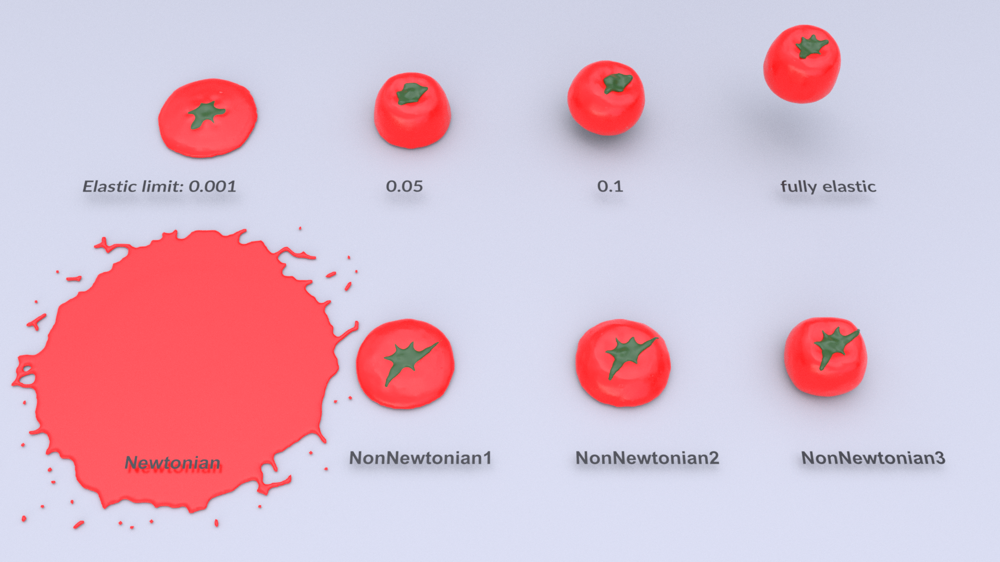

In this paper, we present a unified framework to simulate non-Newtonian behaviors. We combine viscous and elasto-plastic stress into a unified particle solver to achieve various non-Newtonian behaviors ranging from fluid-like to solid-like. Our constitutive model is based on a Generalized Maxwell model, which incorporates viscosity, elasticity and plasticity in one non-linear framework by a unified way. On the one hand, taking advantage of the viscous term, we construct a series of strain-rate dependent models for classical non-Newtonian behaviors such as shear-thickening, shear-thinning, Bingham plastic, etc. On the other hand, benefiting from the elasto-plastic model, we empower our framework with the ability to simulate solid-like non-Newtonian behaviors, i.e., visco-elasticity/plasticity. In addition, we enrich our method with a heat diffusion model to make our method flexible in simulating phase change. Through sufficient experiments, we demonstrate a wide range of non-Newtonian behaviors ranging from viscous fluid to deformable objects. We believe this non-Newtonian model will enhance the realism of physically-based animation, which has great potential for computer graphics.